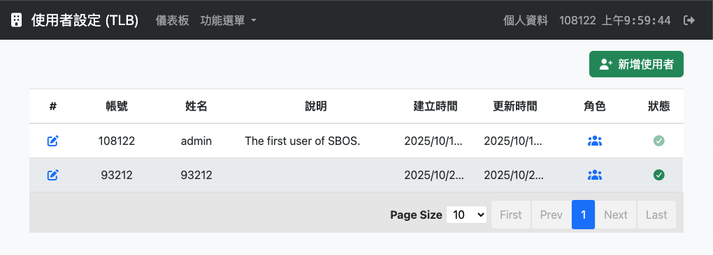
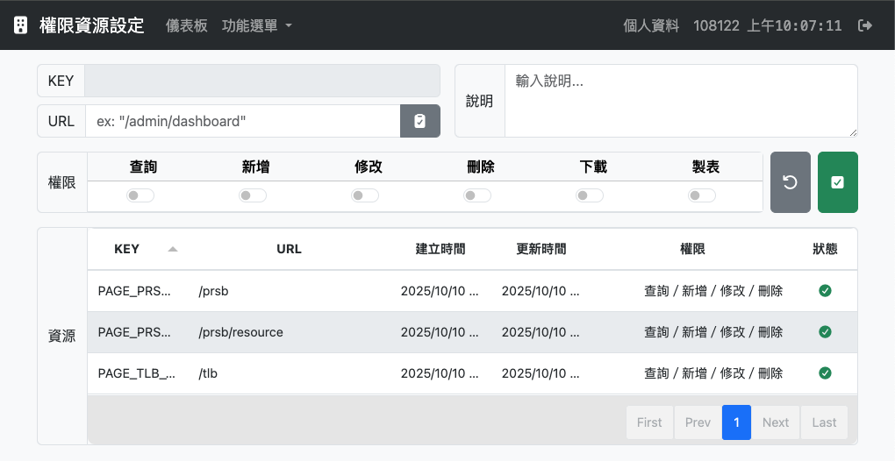
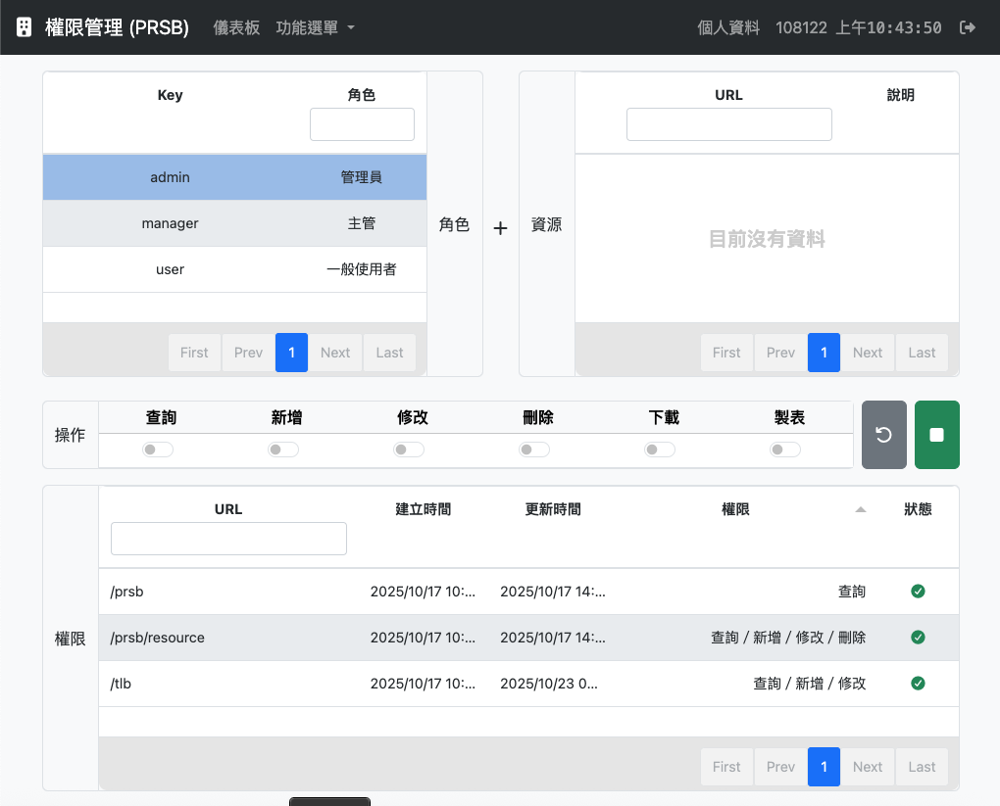

# SBOS
Securities Back-Office System - 證券帳務系統  

這是一個源自`凌群電腦`-`豪賣`的帳務系統，主要由`MHIO`(股票成交進出明細)、`MFIO`(交易進出明細)為核心組成。  

 

## 注意事項

自己從Rocket Software（原`Micro Focus`）COBOL的 `Vision` (ISAM) 用到 Microsoft `SQL Server`，在進到用甲骨文(Oracle)的 `Oracle 11g`，商用資料庫標榜的從來不是先進，而是高可靠與維護性。而只要跟`金錢`扯上關係的，對其資料記錄的安全性又更不能不謹慎。  

雖然說`開源不等於免費`，但是對於大多數台灣企業而言，`MariaDB`與`PostgreSQL`已快要成為免費資料庫的代言人，鮮少聽說有願意為其購買商轉授權並進行長期維運的事情。但是此專案`純屬個人興趣`開發，在此情況下目前還無法將`SBOS`的資料層透過`SQL Server`或`Oracle`來完成，只能暫時先採用`MariaDB`或`PostgreSQL`來實作。為了避免讓人產生錯誤認知：覺得可以使用`免費的技術`完成一套商用系統的建置。這邊還是要重新聲明：資料庫的獨立維運與管理非常重要，系統要能長期運作，仰賴的是資料庫系統的穩定，商用的資料庫及其提供的管理與高可靠方案是不可免的選擇，請認真審視`資料安全性`與`資料穩定性`的問題。  

  

# 初次使用設定

初次使用登入驗證完畢後，會將第一個使用者預設為`系統管理員`，後續可自行至`使用者設定 (TLB)`添加使用者或修改使用者內容。  

  

# 權限與資源

在`RBAC`（`Role-Based Access Control`）的架構下，系統的`資源 (Resource)`即為網頁瀏覽的`URL`。系統資源至少要有`/tlb`、`/prsb`、與`/prsb/resource`這三項資源才好進行後續權限管理與設定。目前可以透過`sequelize-cli`的Seeder來對系統進行資料初始化。  

  

# 權限管理

`管理員`至少要有`/tlb`、`/prsb`、與`/prsb/resource`這三項資源的權限，才能進行完整的權限管理與設定。  

  
