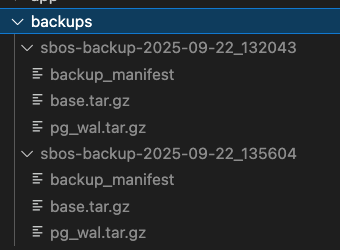

# 使用 `pg_basebackup` 備份資指定料庫

`.env` 設定：
```
POSTGRES_USER=db-admin
POSTGRES_PASSWORD=db-passwd
POSTGRES_DB=postgres
```

<br>

此項作業會產生 **tar 模式壓縮備份**，並且包含 WAL 日誌。結果：

```
/backups/sbos-backup-YYYY-mm-DD_HHMMSS/
├── base.tar.gz      # 主資料庫資料
└── pg_wal.tar.gz    # 對應的 WAL 日誌，用於恢復到一致性狀態
```

## 說明

1. **base.tar.gz**

   * 包含 PostgreSQL 的資料目錄（tables, indexes, schema…）
   * 可用於恢復基本資料庫結構與內容

2. **pg\_wal.tar.gz**

   * 包含從備份開始時刻起的 WAL 日誌
   * 可以用來恢復到備份開始時刻之後的最新一致性狀態
   * 對熱備份與 PITR（point-in-time recovery）非常重要

<br>

# 確保 PostgreSQL 容器允許備份

`pg_basebackup` 需要用 **replication 權限** 或是 superuser。

```yaml
environment:
  POSTGRES_USER: ${POSTGRES_USER}       # 必須是 superuser
  POSTGRES_PASSWORD: ${POSTGRES_PASSWORD}
  POSTGRES_DB: ${POSTGRES_DB}
```

* 預設 `POSTGRES_USER` 如果是 superuser，可以直接使用 `pg_basebackup`。

<br>

# 容器內備份資料庫

執行：

```bash
docker exec sbos-postgres-17 pg_basebackup -U db-admin -v -P -Ft -Z5 -D /backups/sbos-backup-$(date +%F_%H%M%S)
```
* `-U`：使用者
* `-P`：顯示進度
* `-Ft`：tar format
* `-Z5`：gzip compression of tar file output
* `-D`：輸出到備份目錄

<br>

該指令同時備份了`WAL`資料，在備份目錄內應該看到兩個壓縮檔，分別是`base.tar.gz`與`pg_wal.tar.gz`。  


<br>

# 還原備份

1. 停掉 PostgreSQL 容器：

    ```bash
    docker compose down
    ```

2. 清空舊資料：

    ```bash
    docker volume rm sbos-pgdata
    docker volume create sbos-pgdata
    ```

3. 將備份解壓到新 volume：

    base:
    ```bash
    docker run --rm -v sbos-pgdata:/var/lib/postgresql/data -v ./backups/sbos-backup-YYYY-mm-DD_HHMMSS:/backups alpine \
      sh -c "tar xzf /backups/base.tar.gz -C /var/lib/postgresql/data"
    ```

    WAL:
    ```bash
    docker run --rm -v sbos-pgdata:/var/lib/postgresql/data -v ./backups/sbos-backup-YYYY-mm-DD_HHMMSS:/backups alpine \
      sh -c "tar xzf /backups/pg_wal.tar.gz -C /var/lib/postgresql/data/pg_wal"
    ```

4. 重啟容器即可。
    ```bash
    docker compose up -d
    ```

<br>
